# Presentation Details

**Paper Link:** https://arxiv.org/abs/2406.07522

**Title:** "Samba: Simple Hybrid State Space Models for Efficient Unlimited Context Language Modeling"

**Date:** 11 Jun 2024

**Authors:** Liliang Ren, Yang Liu, Yadong Lu, Yelong Shen, Chen Liang, Weizhu Chen


# Samba: Simple Hybrid State Space Models for Efficient Unlimited Context Language Modeling

Attention-based models have been dominant in Large Language Models (LLMs) due to their capacity for capturing complex dependencies and parallelization for large-scale training. Recently, State Space Models (SSMs) have emerged as an alternative, offering linear computational complexity and potentially better extrapolation for long sequences.Specifically, Mamba, a variant of SSMs with selective state spaces, has shown strong performance and efficient hardware use. However, SSMs face challenges in memory recall, particularly in tasks like information retrieval, where attention-based models still excel. Hybrid models combining SSMs and attention have been explored, but none have yet achieved unlimited-length extrapolation. This paper introduce SAMBA, a simple neural architecture that harmonizes the strengths of both the SSM and the attention-based models, while achieving an unlimited sequence length extrapolation with linear time complexity.

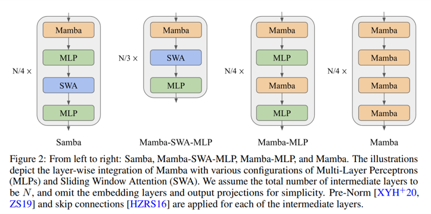

### Key Features
1. **Long contexts ability**:SAMBA exhibits remarkable efficiency in processing long contexts.
2. **Optimization**: Analyses provide insight into the optimal training configurations for hybrid models and underscore the benefits
of combining attention mechanisms with SSMs
3. **Improved Performence**: SAMBA substantially outperforms state-of-the-art pure attention-based and SSM-based models across a wide range of
benchmarks including common-sense reasoning, language understanding, mathematics and coding.

### Architecture

Architecture proposed consists of the layers of Mamba, Sliding Window Attention (SWA), and Multi-Layer Perceptron 

The Mamba layer in SAMBA is expected to capture the time-dependent semantics of the input sequence through its recurrent structure 

The Sliding Window Attention layer is designed to address the limitations of the Mamba layer in capturing non-Markovian dependencies in sequences.

The MLP layers in SAMBA serve as the architecture’s primary mechanism for nonlinear transformation and recall of factual knowledge

### Experiment
The paper do comprehensive downstream evaluations on a wide range of benchmarks, focusing on four main capabilities of the models: 
Commonsense reasoning (ARC, PIQA, WinoGrande,SIQA), Language understanding (HellaSwag, BoolQ, OpenbookQA, SQuAD , MMLU), Truthfulness (TruthfulQA), Math and coding (GSM8K, MBPP, HumanEval).

Four SAMBA models were pretrained with different parameter sizes, 421M, 1.3B, 1.7B and 3.8B, to investigate its performance across different scales.
#### Language Modeling on Textbook Quality Data

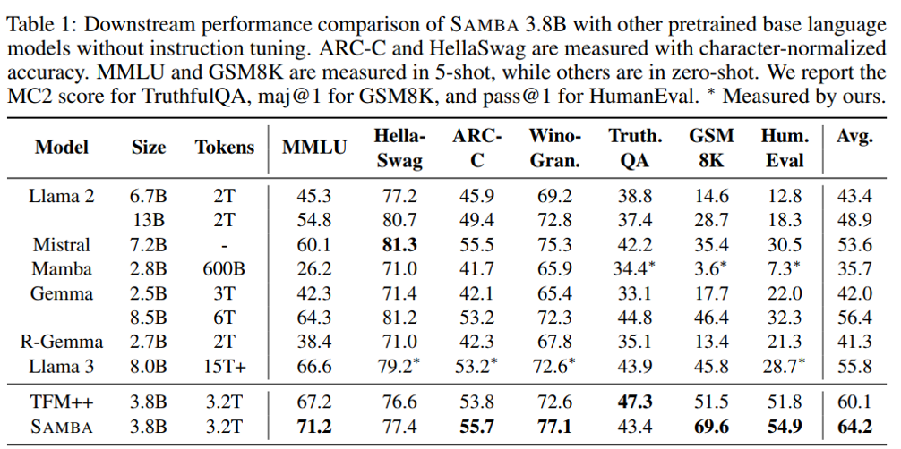

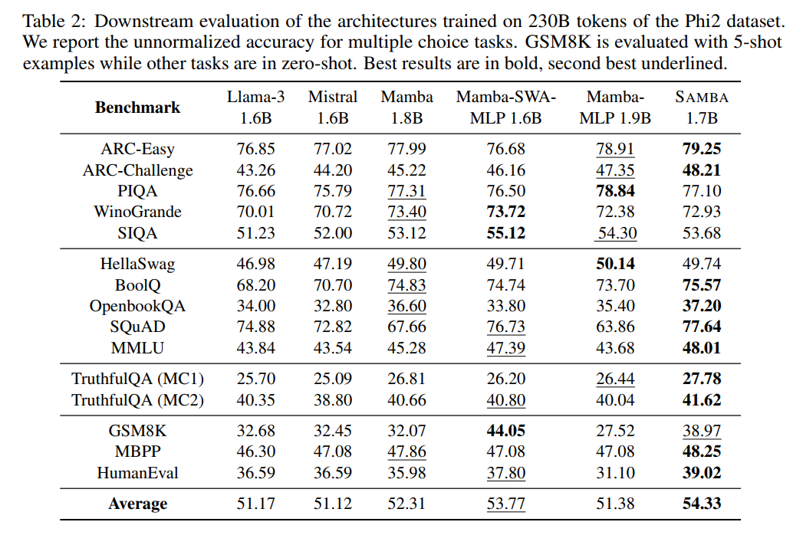

#### Exploration on Attention and Linear Recurrence 

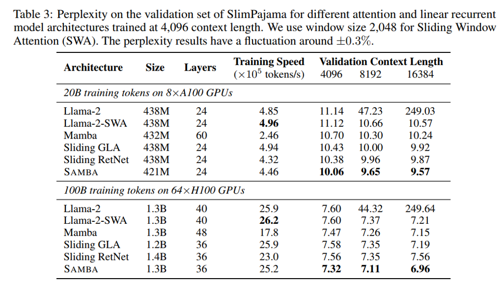

#### Efficient Length Extrapolation

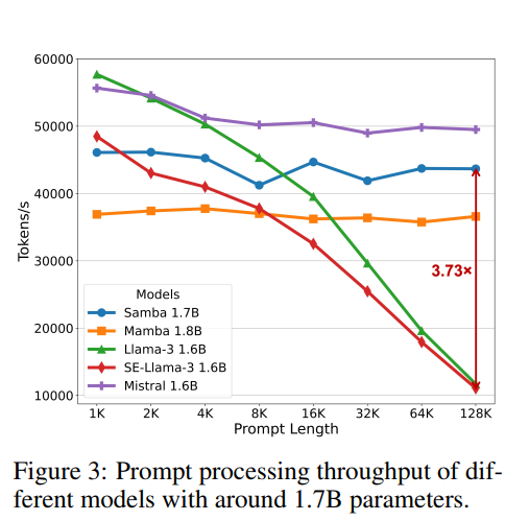

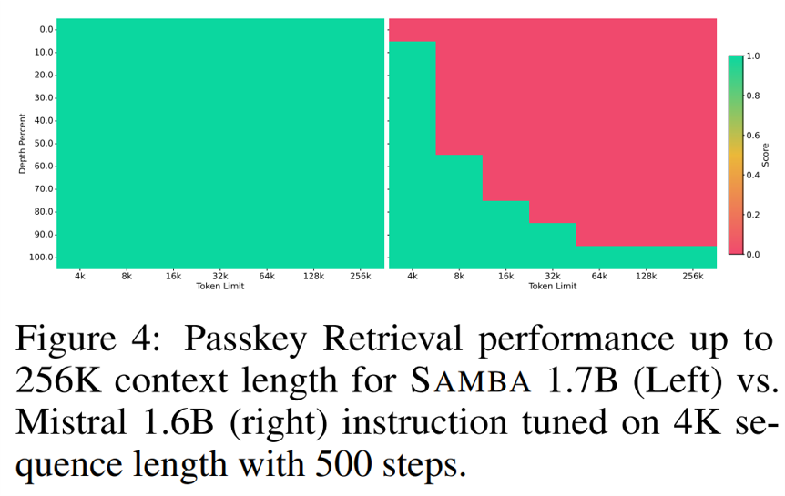

#### Long-Context Understanding

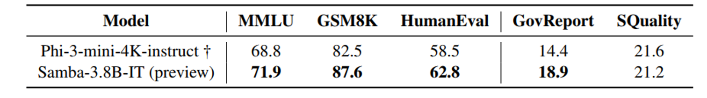

### Analysis

#### How to train models with Sliding Window Attention (SWA)?

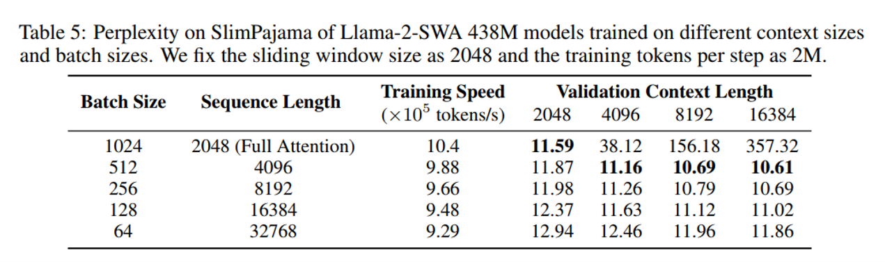

#### Why not hybridize with full attention? 

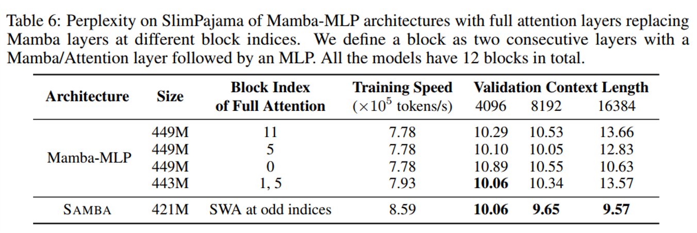

#### How many parameters should be allocated to Attention?

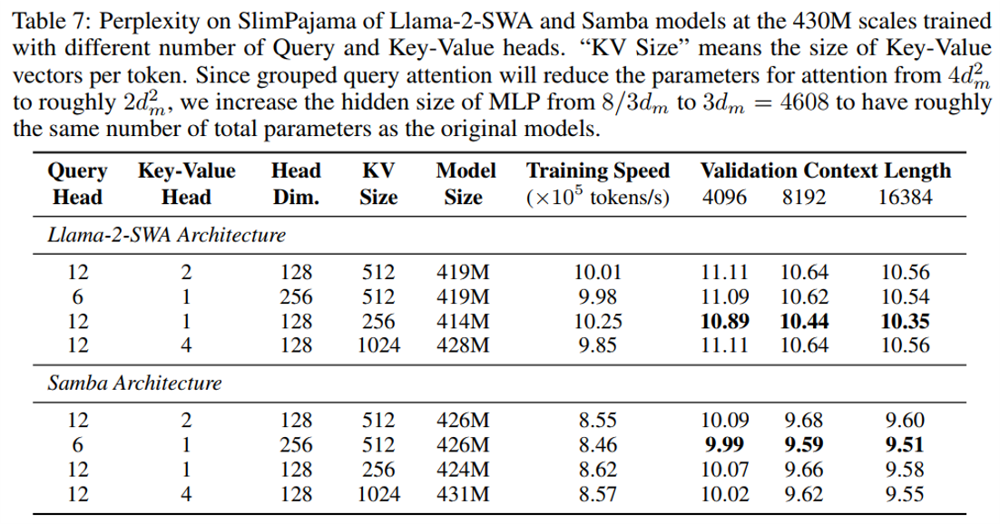

#### Why hybrid is better?

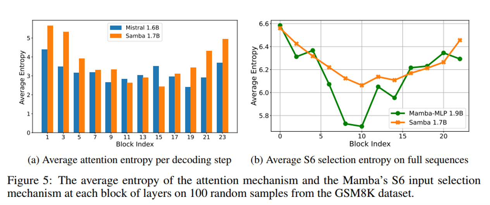

#### Fair comparison between Mamba and other linear recurrent models?

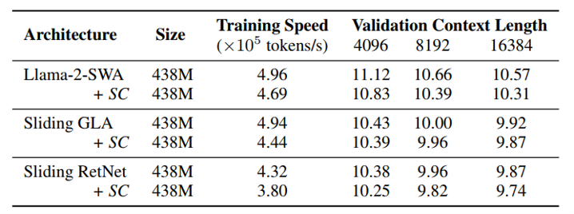

# Critical Analysis

### Key Contribution
SAMBA introduces a hybrid architecture by combining State Space Models (SSMs) with Sliding Window Attention (SWA) to efficiently model long sequences with linear computational complexity. This setup balances SSMs for capturing long-term dependencies with SWA for precise memory recall, setting a new standard for unlimited context modeling.

### Question
Can SAMBA’s architecture maintain performance across a range of NLP tasks, including those that don’t need long memory recall? How adaptable is it to tasks with short or dynamic contexts, and can it scale across different real-world applications with varied sequence lengths and complexities?

### Impact
1. **Long-Term Impact**: SAMBA’s efficiency in modeling long contexts could transform sectors like law, healthcare, and research by enabling large-scale document analysis. Its hybrid design may influence future models, promoting memory-efficient architectures for mobile and IoT applications.
2. **Short-Term Impact**: SAMBA’s high throughput and cost efficiency make it ideal for real-time applications like customer support. Its adaptability across varying context lengths benefits industries with document-heavy workflows, providing immediate value for diverse NLP tasks.

### Limitation
1. **Complexity in Implementation and Tuning**: The hybrid architecture, though powerful, adds complexity in tuning, which may limit adoption in industries lacking technical expertise.
2. **Limited Testing on Short Sequences**: SAMBA’s performance on short-sequence tasks remains less explored, potentially limiting its adaptability in general-purpose NLP.
3. **Scalability in Real-World Applications**: Further testing is needed to confirm SAMBA’s robustness across different real-world environments, ensuring its performance beyond controlled benchmarks.

## Resource Links
1. [Samba GitHub Repository](https://github.com/microsoft/Samba)

## Citation
```text
@article{ren2024samba,
      title={Samba: Simple Hybrid State Space Models for Efficient Unlimited Context Language Modeling}, 
      author={Liliang Ren and Yang Liu and Yadong Lu and Yelong Shen and Chen Liang and Weizhu Chen},
      journal = {arXiv preprint},
      year={2024},
      url={https://arxiv.org/abs/2406.07522}
}
```
